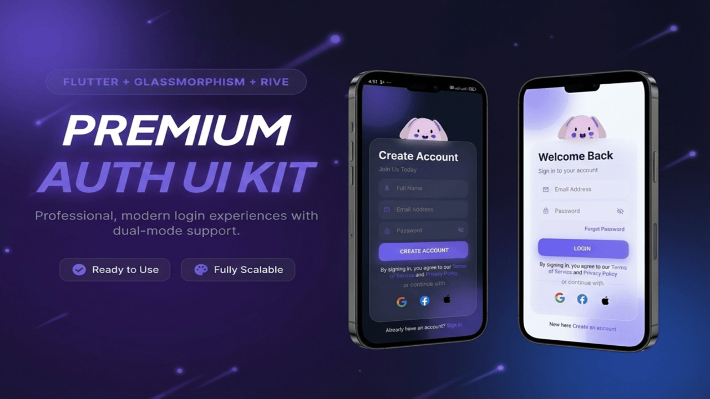

<!-- markdownlint-disable MD033 -->
# 🔐 Premium Authentication UI Template

A production-ready Flutter authentication system with modern glassmorphism design, featuring Login/Signup, Forgot Password flow, and OTP verification. Built with Material 3, responsive design, and zero backend dependencies.

<p align="center">
  
  
  
  
</p>

---

## 📱 Preview

| Screen | Light Mode | Dark Mode |
| :--- | :---: | :---: |
| **Login** |  |  |
| **Signup** |  |  |
| **Forgot Password** |  |  |
| **OTP Verification** |  |  |
| **New Password** |  |  |

---

## 🎬 Demo Video

<p align="center">
<a href="https://www.youtube.com/watch?v=VIDEO_ID">
  
</a>
</p>
<p align="center">
<b><a href="https://www.youtube.com/watch?v=VIDEO_ID">▶️ Watch Full Demo on YouTube</a></b>
</p>

---

## ✨ Features

### 🎨 **Modern UI/UX**

- ✅ **Glassmorphism design** with blur effects and transparency
- ✅ **Smooth animations** and page transitions
- ✅ **Rive animated character** - Interactive bunny/bear responds to user inputs
- ✅ **Gradient backgrounds** with floating orbs
- ✅ **Soft shadows** and rounded corners
- ✅ **Dark/Light mode** support (Material 3)
- ✅ **Fully responsive** (iOS & Android optimized)

### 🔐 **Authentication Screens**

- ✅ **Login/Signup Screen**
  - Seamless toggle between modes with validation
  - Animated character responds to focus changes
  - Eye tracking animation (follows email input)
  - Password eye cover animation (privacy feature)
  - Social login buttons (Google, Facebook, Apple)
  
- ✅ **Forgot Password Screen**
  - Email & Phone number support
  - Country code selector (25+ countries)
  - Live validation feedback
  
- ✅ **OTP Verification**
  - 6-digit OTP with autofocus
  - Auto-advance to next field
  - 60-second countdown timer
  - Resend OTP functionality
  - Masked contact display
  
- ✅ **Create New Password**
  - Password reset with real-time validation
  - Confirm password matching
  - Show/hide password toggle
  
- ✅ **Home Screen**
  - Example post-authentication screen

### 🛡️ **Security & Validation**

- ✅ **Real-time email validation** with visual feedback
- ✅ **Strong password requirements** (8+ chars, uppercase, number, special char)
- ✅ **Phone number validation** (9+ digits)
- ✅ **Name validation** (capital letter requirements)
- ✅ **Password matching** confirmation
- ✅ **Form validation** with TextFormField

---

## 🎬 Rive Animation Integration

<p align="center">
  <a href="https://rive.app/marketplace/19399-36451-logininteraction/">
    <b>View Interactive Animation Source on Rive Marketplace</b>
  </a>
</p>

The project uses **Rive** for the interactive character animation on the Login/Signup screen.

- **Asset Location**: `assets/animated-login-bunny-character.riv`
- **Controller**: Managed in `lib/Logic/auth_logic.dart` (`AuthLogic` class)
- **Interactions**:
  - **`isFocus`**: Triggered when Email or Password field gains focus
  - **`eye_track`**: Follows the cursor length in the Email field
  - **`IsPassword`**: Triggered when Password field is focused (character covers eyes)
  - **`login_success`**: Triggered on successful validation (character smiles)
  - **`login_fail`**: Triggered on validation error (character shakes head)

---

## 📲 Social Icons

Social login buttons use **SVG assets** for crisp rendering on all devices.

- **Asset Location**: `assets/icons/`
  - `assets/icons/google.svg`
  - `assets/icons/facebook.svg`
  - `assets/icons/apple.svg`
- **Implementation**:
  - Used in `login_signup_screen.dart` via `SvgPicture.asset`
  - Reusable `SocialIconButton` widget in `lib/Widgets/social_icon_button.dart`
- **Interactions**: Interactive splash/ink effect on tap (using `InkWell`)

---

## ⚡ Architecture & State Management

The application uses a **simple, clean architecture** for handling state and logic without heavy external dependencies.

### Logic Separation

All business logic is separated into `lib/Logic/auth_logic.dart`.

### State Management

- **`AuthLogic`**: Singleton-like logic class that manages:
  - Rive animation inputs
  - Text controllers
  - Focus nodes
  - Snackbar triggers
- **`setState`**: Used for local UI updates (toggle password visibility, timer updates)
- **`Form` & `GlobalKey`**: Used for input validation handling

### Navigation

Uses standard `Navigator` push/pop for screen transitions.

---

## 📁 Project Structure

```text
lib/
├── main.dart                           # App entry point
│
├── Screens/
│   ├── login_signup_screen.dart       # Login & Signup combined
│   ├── forget_password_screen.dart    # Email/Phone selection
│   ├── otp_verification_screen.dart   # 6-digit OTP input
│   ├── new_password_screen.dart       # Password reset
│   ├── forget_password_flow.dart      # Flow navigation manager
│   └── home_screen.dart               # Post-auth home screen
│
├── Widgets/                           # Reusable UI Components
│   ├── custom_text_field.dart         # Glassmorphism Text Field
│   ├── primary_button.dart            # Gradient Button
│   ├── social_icon_button.dart        # Glassmorphism Social Button
│   └── auth_background.dart           # Reusable Background with Orbs
│
├── Models/
│   └── country_codes_model.dart       # Country code data model
│
├── Logic/
│   └── auth_logic.dart                # Authentication business logic & Rive
│
└── Styles/
    ├── styles.dart                    # Centralized theme & colors
    └── validations.dart               # Email, password, name validators

assets/
├── animated-login-bunny-character.riv # Rive animation file
├── fonts/
│   └── Inter/                         # Inter font family
└── icons/
    ├── google.svg                     # Google icon
    ├── facebook.svg                   # Facebook icon
    └── apple.svg                      # Apple icon
```

---

## 🚀 Getting Started

### Prerequisites

- Flutter 3.0 or higher (used 3.38.6)
- Dart 3.0 or higher (used 3.10.7)
- Android Studio / Xcode for running

### Installation

1. **Clone or download the template**

```bash
git clone <repository-url>
cd ui_templates
```

1. **Install dependencies**

```bash
flutter pub get
```

1. **Run the app**

```bash
flutter run
```

---

## 📖 Usage Guide

### 1. **Login/Signup Screen**

<p align="center">
  
  
</p>

Located in `lib/Screens/login_signup_screen.dart`

**Features:**

- Toggle between Login and Signup modes
- Email validation on focus change with checkmark indicator
- Password strength requirements with show/hide toggle
- Full name validation (only for signup mode)
- Form validation before submission
- **Rive animated character** that responds to interactions:
  - Eyes track email input length
  - Eyes close when typing password
  - Character smiles on successful login
  - Character shakes on validation error
- **Social Login Buttons:**
  - Google (Red) - UI ready for Firebase integration
  - Facebook (Blue) - UI ready for Facebook SDK
  - Apple (Black) - UI ready for Sign in with Apple

**Navigate to home screen:**

```dart
Navigator.push(
  context,
  MaterialPageRoute(builder: (context) => const HomeScreen()),
);
```

---

### 2. **Forget Password Flow**

<p align="center">
  
  
  
</p>

Located in `lib/Screens/forget_password_flow.dart`

The flow handles three screens automatically:

#### **Screen 1: Forgot Password**

- Choose between Email or Phone recovery
- **Email**: Standard email input with validation
- **Phone**: Country code selector (25+ countries) + phone number
- Real-time validation with visual feedback

#### **Screen 2: OTP Verification**

- 6 separate digit boxes with custom styling
- Autofocus on first box
- Auto-move to next field on input
- 60-second countdown timer (starts on resend)
- Masked contact display for privacy (e.g., `a***@example.com`)

#### **Screen 3: Create New Password**

- New password field with validation
- Confirm password field with matching check
- Show/hide password toggle for both fields
- Form validation before reset
- Navigate to Login Screen

**Navigate to Login password:**

```dart
// Password reset complete - Return to Login Screen
  void _handlePasswordReset() {
    // Show Success Message
    authLogic.showSuccessSnack('Password Reset Successfully', context);
    // Return to Login after delay
    Future.delayed(const Duration(milliseconds: 500), () {
      if (mounted) {
        widget.onBackToLogin();
      }
    });
  }
```

---

### 3. **Validation System**

All validations are centralized in `lib/Styles/validations.dart`

#### **Email Validation:**

```dart
String? validateEmail(String? email) {
  // Checks: not empty, valid email format
  // Returns: null if valid, error message if invalid
}
```

**Rules:**

- Must not be empty
- Must contain `@` and `.`
- Must follow standard email format

#### **Password Validation:**

```dart
String? validatePassword(String? password, {bool isSignup = false}) {
  // Checks: 8+ chars, uppercase, number, special char
  // Returns: null if valid, error message if invalid
}
```

**Rules:**

- Minimum 8 characters
- At least one uppercase letter
- At least one number
- At least one special character (`!@#$%^&*`)

#### **Name Validation:**

```dart
String? validateName(String? name) {
  // Checks: not empty, starts with capital letter
  // Returns: null if valid, error message if invalid
}
```

**Rules:**

- Must not be empty
- Must start with a capital letter

#### **Phone Validation:**

```dart
String? validatePhoneNumber(String? phone) {
  // Checks: 9+ digits, numbers only
  // Returns: null if valid, error message if invalid
}
```

**Rules:**

- Must be at least 9 digits
- Must contain only numbers

---

### 4. **Styling & Themes**

<p align="center">
  
</p>

All colors, spacing, and typography are centralized in `lib/Styles/styles.dart`

#### **Colors**

```dart
// Colors
AppTheme.primaryAccent           // Main purple color (#6C63FF)
AppTheme.lightBg                 // Background color (#F8FAFC)
AppTheme.darkBg                 // Background color (#0F172A)
AppTheme.errorRed                // Error state (#EF4444)
AppTheme.successGreen            // Success state (#10B981)

```

#### **Spacing**

```dart
AppTheme.spacingSmall = 8
AppTheme.spacingMedium = 16
AppTheme.spacingMediumLarge = 20
AppTheme.spacingLarge = 24
AppTheme.spacingXLarge = 28
AppTheme.spacingXXLarge = 40
```

---

#### **Border Radius**

```dart
AppTheme.borderRadiusSmall = 16
AppTheme.borderRadiusMedium = 30
AppTheme.borderRadiusLarge = 40
```

#### **Text Styles**

```dart
AppTheme.headingStyle(isDark)     // Large heading text
AppTheme.subheadingStyle(isDark)  // Sub heading text style
AppTheme.bodyStyle(isDark)        // Body paragraph text
AppTheme.buttonStyle              // Button text style
AppTheme.subtitleStyle(isDark)    // Subtitle text style
```

#### **Decoration Helpers**

```dart
AppTheme.backgroundGradient(isDark)  // Background Gradient
AppTheme.socialButtonDecoration(isDark)   // Social button style
AppTheme.inputDecoration(isDark)         // Input box style
```

---

### 5. **Authentication Logic**

Located in `lib/Logic/auth_logic.dart`

**Handles:**

- Rive animation initialization and state management
- Focus node listeners for input fields
- Snackbar messages (success/error)
- Field clearing on mode toggle
- Eye track animation updates based on email length

**Key Methods:**

```dart
class AuthLogic {
  // Rive Animation
  void initRive() // Initialize Rive controller and inputs
  void setupListeners() // Setup listeners for focus nodes
  void updateEyeTrack(String email) // Update eye tracking animation
  void triggerSuccess() // Trigger success animation
  void triggerFail() // Trigger failure animation
  
  // Validation & Feedback
  void showSuccessSnack(String message, BuildContext context) // Show success snackbar
  void showErrorSnack(String message, BuildContext context) // Show error snackbar
  
  // Cleanup
  void clearFields() // Clear all text controllers
  void dispose() // Dispose focus nodes
}
```

---

## 🎨 Customization

### Change Primary Color

In `lib/Styles/styles.dart`:

```dart
static const Color primaryAccent = Color(0xFF6C63FF); // Change to your brand color
```

This will automatically update:

- Button gradients
- Accent highlights
- Focus indicators
- Success messages

---

### 🔠 Typography & Fonts

<p align="center">
  <a href="https://rsms.me/inter/"><b>Inter Font Family</b></a>
</p>

The project uses the **Inter** font family for a clean, modern look.

#### **Using a Different Font**

1. **Add the font files**: Place your `.ttf` or `.otf` files in `assets/fonts/`

2. **Update `pubspec.yaml`**:

```yaml
fonts:
  - family: YourFontName
    fonts:
      - asset: assets/fonts/YourFont-Regular.ttf
      - asset: assets/fonts/YourFont-Bold.ttf
        weight: 700
```

1. **Update `lib/Styles/styles.dart`**:

Change the `fontFamily` in `lightTheme` and `darkTheme`:

```dart
static ThemeData lightTheme = ThemeData(
  // ...
  fontFamily: 'YourFontName',
);
```

Also update any explicit `fontFamily` references in `TextStyle` objects within the same file.

---

### Add More Countries

In `lib/Screens/forget_password_screen.dart`:

```dart
final List<CountryCode> codes = [
  // Add new country:
  CountryCode(
    code: 'IT', // Country code
    dialCode: '+39', // Dial code
    name: 'Italy', // Country name
    flag: '🇮🇹' // Country flag
  ),
  CountryCode(
    code: 'DE', // Country code
    dialCode: '+49', // Dial code
    name: 'Germany', // Country name
    flag: '🇩🇪' // Country flag
  ),
  // ... existing countries
];
```

---

### Modify Validation Rules

In `lib/Styles/validations.dart`:

```dart
bool isPasswordValid(String password, String? confirmPassword) {
  // Customize requirements here
  return hasLength(password) &&     // minimum length(8) / maximum length(15)
      hasUpperCase(password) &&
      hasDigit(password) &&
      hasSpecialChar(password);
}
```

---

### Change Timer Duration

In `lib/Screens/otp_verification_screen.dart`:

```dart
int _timeLeft = 60; // Change to your desired seconds (default: 60)
```

---

---

## 🔧 Configuration

### Main App Setup

In `lib/main.dart`:

```dart
void main() {
  // Defensive Handling: Custom Error Widget for the whole app
  // This replaces the "Red Screen of Death" in production.
  ErrorWidget.builder = (FlutterErrorDetails details) {
    return Material(
      child: Container(
        color: AppTheme.darkBg,
        child: Center(
          child: Text(
            "Something went wrong in the UI. Try ReOpen the App",
            style: AppTheme.buttonStyle.copyWith(color: AppTheme.errorRed),
          ),
        ),
      ),
    );
  };
  runApp(MyApp());
}

class MyApp extends StatelessWidget {
  const MyApp({super.key});

  @override
  Widget build(BuildContext context) {
    return MaterialApp(
      title: 'Auth UI Template',
      debugShowCheckedModeBanner: false,      // Hide debug banner
      theme: AppTheme.lightTheme,
      darkTheme: AppTheme.darkTheme,
      themeMode: ThemeMode.system,            // Auto switch based on system
      home: const AuthScreen(),                      // Main Auth Screen
    );
  }
}
```

---

## 📋 Screen Details

### Login/Signup (`login_signup_screen.dart`)

| Feature           | Details                                   |
|-------------------|-------------------------------------------|
| Email Validation  | Real-time with checkmark indicator        |
| Password Strength | 8+ chars, uppercase, number, special char |
| Name Validation   | Capital first letter required (signup)    |
| Animation         | Rive character responds to inputs         |
| Social Buttons    | Google, Facebook, Apple (UI ready)        |
| Form Validation   | All fields validated before submission    |

---

### Forgot Password (`forget_password_screen.dart`)

| Feature     | Details                              |
|-------------|--------------------------------------|
| Methods     | Email or Phone number recovery       |
| Email Input | Standard email field with validation |
| Phone Input | Country selector + number field      |
| Countries   | 25+ countries with flags & dial codes|
| Validation  | Live validation with visual feedback |
| Button      | Enabled only when input is valid     |
| Navigation  | Auto-advances to OTP screen          |

---

### OTP Verification (`otp_verification_screen.dart`)

| Feature         | Details                                    |
|-----------------|--------------------------------------------|
| OTP Format      | 6 separate digit boxes                     |
| Auto-Focus      | First box focused on screen load           |
| Auto-Move       | Moves to next box automatically on input   |
| Masking         | Email/Phone masked for privacy             |
| Timer           | 60-second countdown (starts on resend)     |
| Resend          | Available after timer reaches 0            |
| Contact Display | Shows masked email (a***@example.com)      |
| Validation      | Verifies all 6 digits are entered          |

---

### New Password (`new_password_screen.dart`)

| Feature        | Details                                   |
|----------------|-------------------------------------------|
| Validation     | Uses TextFormField validators             |
| Password Rules | 8+ chars, uppercase, number, special char |
| Confirmation   | Must match new password exactly           |
| Toggle         | Show/Hide password visibility             |
| Error Display  | Below field in red text                   |
| Button         | Enabled when all validations pass         |
| Success        | Shows success message on reset            |

---

## 🎯 Best Practices

### ✅ Do's

- ✅ Use `setState()` or any other State Management(Provider, Riverpod, Bloc, etc) when updating PageView content or UI state
- ✅ Always dispose controllers, focus nodes, and timers in `dispose()`
- ✅ Validate on both field blur and form submission for best UX
- ✅ Show clear, helpful error messages to users
- ✅ Use consistent spacing from `AppTheme` in `styles.dart`
- ✅ Keep API integration separate from UI logic
- ✅ Test on both iOS and Android devices
- ✅ Use `MediaQuery` for responsive layouts

### ❌ Don'ts

- ❌ Don't hardcode colors - always use `AppTheme` constants
- ❌ Don't mix validation logic - centralize in `validations.dart`
- ❌ Don't create controllers without disposing them (memory leaks)
- ❌ Don't show sensitive data without proper masking
- ❌ Don't use magic numbers - define constants in `styles.dart`
- ❌ Don't skip form validation before API calls
- ❌ Don't forget to handle edge cases (network errors, timeout, etc.)

---

## 🐛 Troubleshooting

### **Issue: OTP masked contact not showing**

**Solution:** Use `setState()` before navigating in `_goToOTPScreen()`

```dart
setState(() {
  _userContact = contact;
  _isEmailMethod = isEmail;
});
_pageController.animateToPage(1, ...);
```

---

### **Issue: Timer showing on OTP screen load**

**Solution:** Timer only starts on resend click (already fixed in template)

```dart
// Correct implementation
bool _timerActive = false;

void _startTimer() {
  setState(() => _timerActive = true);
  // Timer logic...
}
```

---

### **Issue: Fields not clearing on toggle**

**Solution:** Use `_authLogic.clearFields()` when toggling modes

```dart
void _toggleAuthMode() {
  _authLogic.clearFields();           // 1. Wipes data from all text controllers
  _formKey.currentState?.reset();     // 2. Clears validation error messages
  
  // 3. Reset Rive animation focus states
  _authLogic.isFocus?.value = false;
  _authLogic.isPassword?.value = false;
  
  setState(() {
    AuthLogic.isLogin = !AuthLogic.isLogin; // 4. Switch between Login/Signup UI
  });
}
```

---

### **Issue: Validation errors not showing**

**Solution:** Ensure all inputs are wrapped in a `Form` widget with a assigned `GlobalKey`, and call `.validate()` before any submission logic.
Check `validations.dart` for validation methods

```dart
// 1. Assign a GlobalKey to your Form
final _formKey = GlobalKey<FormState>();

// 2. Wrap your fields in the Form widget
Form(
  key: _formKey,
  child: Column(
    children: [
      CustomTextField(
        validator:(value)=> validateEmail(value),//email validation example
      ),
      // Other fields
    ],
  ),
)

// 3. Trigger validation in your button handler
void _handleSubmit() {
  if (_formKey.currentState!.validate()) {
    // If true, the UI will show error messages for invalid fields
    // Proceed with API/Firebase call
  }
}
```

---

### **Issue: Rive animation not loading**

**Solution:** Ensure asset is added to `pubspec.yaml`

```yaml
flutter:
  assets:
    - assets/animated-login-bunny-character.riv
```

Then run `flutter pub get` and restart the app.

---

### **Issue: Social icons not displaying**

**Solution:** Ensure SVG assets are added to `pubspec.yaml`

```yaml
flutter:
  assets:
    - assets/icons/google.svg
    - assets/icons/facebook.svg
    - assets/icons/apple.svg
```

---

### **Issue: Dark mode not switching**

**Solution:** Ensure `Theme.of(context).brightness` is used

```dart
bool isDark = Theme.of(context).brightness == Brightness.dark;
```

Or use `MediaQuery.of(context).platformBrightness`

---

## 📱 Platform Support

| Platform | Status              | Notes                                           |
|----------|---------------------|-------------------------------------------------|
| Android  | ✅ **Fully Tested** | Tested on Android 5.0+ (API 21+)                |
| iOS      | ✅ UI Compatible    | Flutter-native code, should work seamlessly*    |
| Web      | ⚠️ Not Optimized    | Runs but layout needs responsive adjustments    |
| macOS    | ✅ UI Compatible    | Flutter-native code, should work seamlessly*    |
| Windows  | ⚠️ Not Optimized    | Runs but not designed for desktop layouts       |
| Linux    | ⚠️ Not Optimized    | Runs but not designed for desktop layouts       |

**\*iOS/macOS:** Code is Flutter-native and uses standard Material widgets. UI should work perfectly, but not physically tested. If you encounter any iOS-specific issues, please report them and we'll fix within 48 hours

---

## 📦 Dependencies

This template uses minimal dependencies for maximum flexibility:

```yaml
dependencies:
  flutter:
    sdk: flutter
  
  # Essential packages
  rive: ^0.13.1              # Interactive character animation
  flutter_svg: ^2.2.3        # Social icons rendering

# No heavy state management libraries
# No bloated UI frameworks
# Easy to integrate with your existing codebase
```

> **Note:** Package versions shown are current as of February 2026. Always check [pub.dev](https://pub.dev) for the latest versions.
---

## Backend Integration Guide

<details>
<summary><strong>CLICK TO EXPAND – FIREBASE INTEGRATION GUIDE</strong></summary>
<br>
This template is **UI-only** and ready for backend integration. Here's how to connect it to your Backend(Firebase, Supabase, etc). Below Guide is ONLY for the **Firebase Integration**

### 1. **Login/Signup Integration**

In `lib/Screens/login_signup_screen.dart`, locate the `_handleAuth()` method:

```dart
Future<void> _handleAuth() async {
  if (_formKey.currentState!.validate()) {
    try {
      setState(() => _isLoading = true);

      if (_isSignup) {
        // Firebase Signup
        await FirebaseAuth.instance.createUserWithEmailAndPassword(
          email: _emailController.text.trim(),
          password: _passwordController.text.trim(),
        );
      } else {
        // Firebase Login
        await FirebaseAuth.instance.signInWithEmailAndPassword(
          email: _emailController.text.trim(),
          password: _passwordController.text.trim(),
        );
      }

      _authLogic.triggerSuccess();
      
      Navigator.pushReplacement(
        context,
        MaterialPageRoute(builder: (context) => const HomeScreen()),
      );
    } on FirebaseAuthException catch (e) {
      _authLogic.triggerFail();
      _authLogic.showErrorSnack(e.message ?? 'Authentication failed', context);
    } catch (e) {
      _authLogic.triggerFail();
      _authLogic.showErrorSnack(e.toString(), context);
    } finally {
      setState(() => _isLoading = false);
    }
  }
}
```

---

### 2. **Forgot Password Integration**

In `lib/Screens/forget_password_flow.dart`, locate the `_goToOTPScreen()` method:

```dart
Future<void> _goToOTPScreen() async {
  if (_forgotFormKey.currentState!.validate()) {
    try {
      setState(() => _isLoading = true);
      
      final contact = _isEmailMethod 
          ? _emailController.text.trim() 
          : '${_selectedCountry.dialCode}${_phoneController.text.trim()}';
      
      if (_isEmailMethod) {
        // Firebase Email Reset (Sends Link)
        await FirebaseAuth.instance.sendPasswordResetEmail(email: contact);
        _authLogic.showSuccessSnack('Password reset link sent to your email', context);
      } else {
        // Firebase Phone Reset (Sends SMS OTP)
        await FirebaseAuth.instance.verifyPhoneNumber(
          phoneNumber: contact,
          verificationCompleted: (PhoneAuthCredential credential) {
            // Option: Auto-verify on some Android devices
          },
          verificationFailed: (FirebaseAuthException e) {
            _authLogic.showErrorSnack(e.message ?? 'Verification failed', context);
          },
          codeSent: (String verificationId, int? resendToken) {
            // Store verificationId and navigate to OTP Screen
            _verificationId = verificationId;
            _pageController.animateToPage(
              1,
              duration: const Duration(milliseconds: 300),
              curve: Curves.easeInOut,
            );
          },
          codeAutoRetrievalTimeout: (String verificationId) {},// method is used to auto-retrieve the OTP from the SMS.
        );
      }
    } catch (e) {
      _authLogic.showErrorSnack(e.toString(), context);
    } finally {
      setState(() => _isLoading = false);
    }
  }
}
```

---

### 3. **OTP Verification Integration**

In `lib/Screens/otp_verification_screen.dart`, locate the `_handleVerifyOTP()` method:

```dart
Future<void> _handleVerifyOTP() async {
  // Combine all OTP digits
  String otp = _otpControllers.map((c) => c.text).join();
  
  if (otp.length == 6) {
    try {
      setState(() => _isLoading = true);
      
      // Create a PhoneAuthCredential with the code
      PhoneAuthCredential credential = PhoneAuthProvider.credential(
        verificationId: _verificationId, // Obtained from Step 2
        smsCode: otp,
      );

      // Verify and sign in/reset
      await FirebaseAuth.instance.signInWithCredential(credential);
      
      // OTP verified, navigate to password reset
      _pageController.animateToPage(
        2,
        duration: const Duration(milliseconds: 300),
        curve: Curves.easeInOut,
      );
    } catch (e) {
      _authLogic.showErrorSnack('Invalid OTP. Please try again.', context);
      // Clear OTP fields on error
      for (var controller in _otpControllers) {
        controller.clear();
      }
      _otpFocusNodes[0].requestFocus();
    } finally {
      setState(() => _isLoading = false);
    }
  }
}
```

---

### 4. **Password Reset Integration**

In `lib/Screens/new_password_screen.dart`, locate the `_handleResetPassword()` method:

```dart
Future<void> _handleResetPassword() async {
  if (_formKey.currentState!.validate()) {
    try {
      setState(() => _isLoading = true);
      
      // Update password for the currently signed-in user
      // Useful after OTP verification confirms identity
      await FirebaseAuth.instance.currentUser?.updatePassword(_passwordController.text.trim());
      
      _authLogic.showSuccessSnack(
        'Password reset successfully!',
        context,
      );
      
      // Navigate back to login
      await Future.delayed(const Duration(seconds: 2));
      widget.onBackToLogin();
    } catch (e) {
      _authLogic.showErrorSnack(e.toString(), context);
    } finally {
      setState(() => _isLoading = false);
    }
  }
}
```

---

### 5. **Social Login Integration**

In `lib/Screens/login_signup_screen.dart`, locate the social button callbacks:

```dart
// Google Sign In
Future<void> _handleGoogleSignIn() async {
  try {
    setState(() => _isLoading = true);
    
    // Trigger Google Sign In flow
    final GoogleSignInAccount? googleUser = await GoogleSignIn().signIn();
    
    if (googleUser != null) {
      final GoogleSignInAuthentication googleAuth = 
          await googleUser.authentication;
      
      // Create a new credential
      final credential = GoogleAuthProvider.credential(
        accessToken: googleAuth.accessToken,
        idToken: googleAuth.idToken,
      );
      
      // Once signed in, return the UserCredential
      await FirebaseAuth.instance.signInWithCredential(credential);
      
      _authLogic.triggerSuccess();
      Navigator.pushReplacement(
        context,
        MaterialPageRoute(builder: (context) => const HomeScreen()),
      );
    }
  } catch (e) {
    _authLogic.triggerFail();
    _authLogic.showErrorSnack(e.toString(), context);
  } finally {
    setState(() => _isLoading = false);
  }
}

// Similar implementations for Facebook (FacebookAuthProvider) 
// and Apple (AppleAuthProvider)
```

---

### 6. **Firebase Configuration**

Ensure you initialize Firebase in your `lib/main.dart` before calling `runApp()`:

```dart
import 'package:firebase_core/firebase_core.dart';
import 'firebase_options.dart'; // Generated by Flutterfire CLI

void main() async {
  WidgetsFlutterBinding.ensureInitialized();
  await Firebase.initializeApp(
    options: DefaultFirebaseOptions.currentPlatform,
  );
  
  // Custom Error Widget handling...
  runApp(MyApp());
}
```

> [!TIP]
> Use the [FlutterFire CLI](https://firebase.flutter.dev/docs/cli/) to automatically configure Firebase for your project.
<br>
> **Note:** `Provided Guide Code can be changed or wrong or not work as expected`.

---

### 7. **Recommended Packages for Backend**

Add these to your `pubspec.yaml`:

```yaml
dependencies:
  # HTTP Client
  http: ^1.6.0
  
  # Secure Storage & Persistence
  flutter_secure_storage: ^9.2.4
  shared_preferences: ^2.5.4
  
  # Firebase Core & Auth
  firebase_core: ^4.4.0
  firebase_auth: ^6.1.4
  
  # Firebase Extensions (Database, Storage, etc.)
  cloud_firestore: ^6.1.2
  firebase_database: ^12.1.3
  firebase_storage: ^13.0.6
  
  # Social Auth (optional)
  google_sign_in: ^7.2.0
  flutter_facebook_auth: ^7.1.5
  sign_in_with_apple: ^7.0.1
  
  # State Management (if needed)
  provider: ^6.1.5
  # or
  riverpod: ^3.2.1
```

> **Note:** Package versions shown are current as of February 2026. Always check [pub.dev](https://pub.dev) for the latest versions.
</details>

---

## 🎓 Learning Resources

- [Flutter Documentation](https://flutter.dev/docs) - Official Flutter docs
- [Material Design 3](https://m3.material.io/) - Material 3 guidelines
- [Dart Language Guide](https://dart.dev/guides) - Dart programming
- [Rive Documentation](https://help.rive.app/) - Rive animation tutorials
- [Form Validation in Flutter](https://flutter.dev/docs/cookbook/forms/validation) - Form handling

---

## 📄 License

Licensed under [CodeCanyon Standard License](https://codecanyon.net/licenses/standard).

**Regular License (included with purchase):**

- Use in one end product
- Modify as needed
- No attribution required

**Extended License (available on CodeCanyon):**

- Unlimited projects
- Resale rights

<p>For complete terms, visit the CodeCanyon license page</p>

---

## 🤝 Support

Need help? We've got you covered:

1. **📚 Documentation**: Check this README and code comments
2. **🔍 Troubleshooting**: See the troubleshooting section above
3. **💬 Email Support**: <support@example.com> (30 days free for full kit)
4. **🐛 Bug Reports**: Open an issue on GitHub
5. **💡 Feature Requests**: Let us know what you need

**Response Time:**

- Email support: Within 24 hours
- Bug fixes: Within 48 hours
- Feature requests: Evaluated monthly

---

## 🎉 What's Included

✅ **Complete authentication flow** (Login, Signup, Password Recovery)  
✅ **Modern glassmorphism UI** with blur effects  
✅ **Rive animated character** that responds to user input  
✅ **Email & phone support** for password recovery  
✅ **OTP verification** with countdown timer  
✅ **Dark/Light mode** with Material 3  
✅ **Fully responsive** design (iOS & Android)  
✅ **Production-ready code** with clean architecture  
✅ **Comprehensive validation** for all inputs  
✅ **Error handling** and user feedback  
✅ **Smooth animations** and transitions  
✅ **Social login buttons** (UI ready for integration)  
✅ **Reusable components** for your app  
✅ **Zero backend required** (UI template only)  
✅ **Complete documentation** with examples  
✅ **Backend integration guide** included  

---

## 🚀 Next Steps

Ready to build amazing authentication experiences? Here's your roadmap:

### **Immediate Setup** (5 minutes)

1. ✅ Download and extract the template
2. ✅ Run `flutter pub get`
3. ✅ Run `flutter run` to see it in action

### **Customization** (30 minutes)

1. ✅ Change brand colors in `styles.dart`
2. ✅ Update app name in `main.dart`
3. ✅ Customize validation rules if needed
4. ✅ Add your logo/branding

### **Backend Integration** (2-4 hours)

1. ✅ Set up your API endpoints
2. ✅ Implement authentication logic
3. ✅ Add secure token storage
4. ✅ Test the complete flow

### **Production Deployment** (varies)

1. ✅ Test on real devices (iOS & Android)
2. ✅ Configure Firebase/backend services
3. ✅ Set up analytics and crash reporting
4. ✅ Submit to App Store/Google Play

---

## 🌟 Showcase

Built something amazing with this template? We'd love to see it!

Share your work:

- 📧 Email: <seraa.dev@gmail.com>

---

## 📊 Version History

### **v1.0.0** (February 2026) - Initial Release

- ✅ Complete authentication flow
- ✅ Rive character animation
- ✅ Dark/Light mode support
- ✅ OTP verification with timer
- ✅ Social login UI
- ✅ Comprehensive documentation

---

## Credits

**Built with:**

- Flutter & Dart
- Rive for animations
- Material Design 3
- Inter font family
- Flutter SVG for icons

---

<p align="center">
  <b>Made with ❤️ for beautiful, modern authentication experiences.</b>
</p>

<p align="center">
  <i>Last Updated: February 2026 | Version: 1.0.0</i>
</p>

<p align="center">
  <a href="#-premium-authentication-ui-template">Back to Top ↑</a>
</p>

---

## 📞 Contact

- **Email**: <seraa.dev@gmail.com>

---
