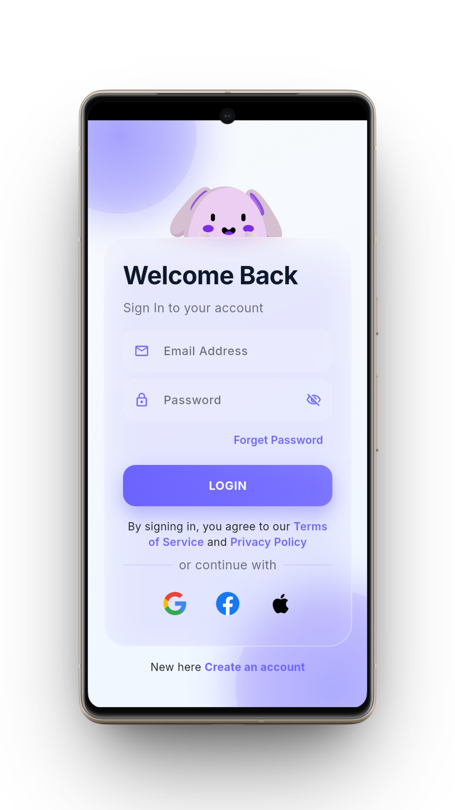
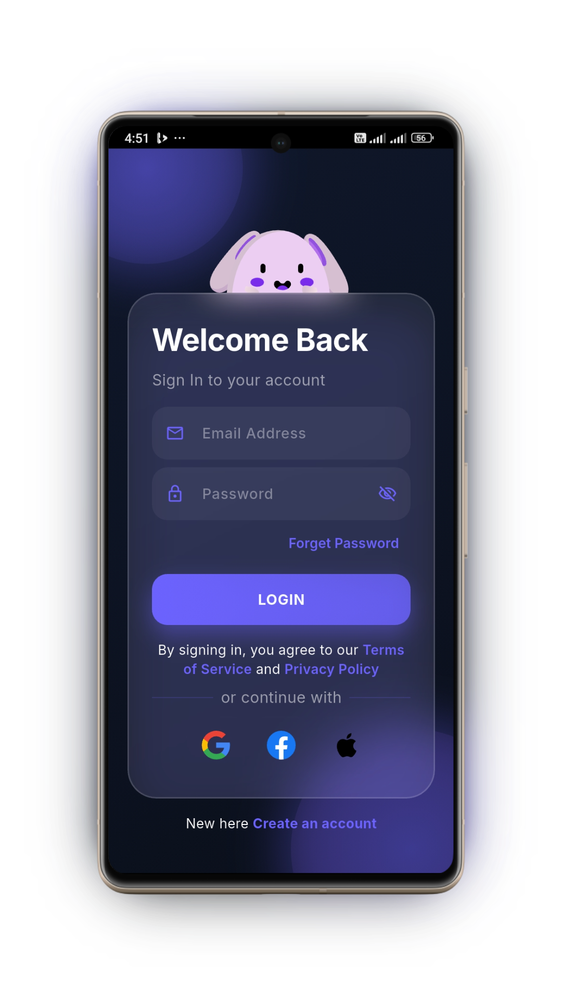
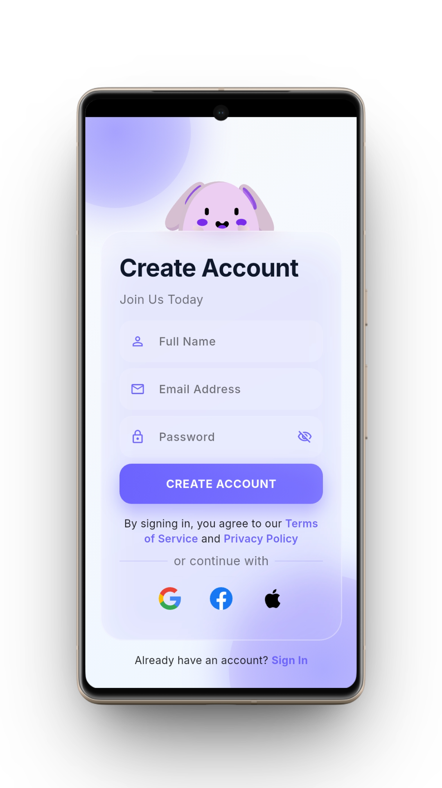
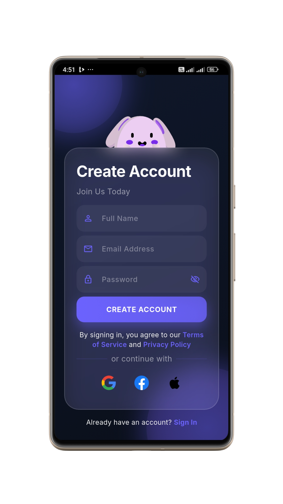
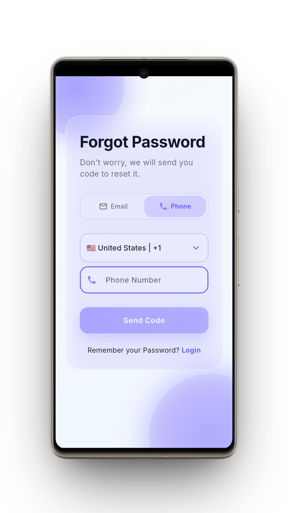
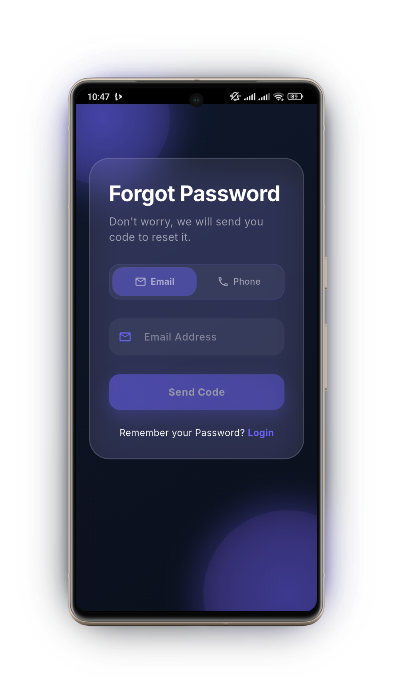
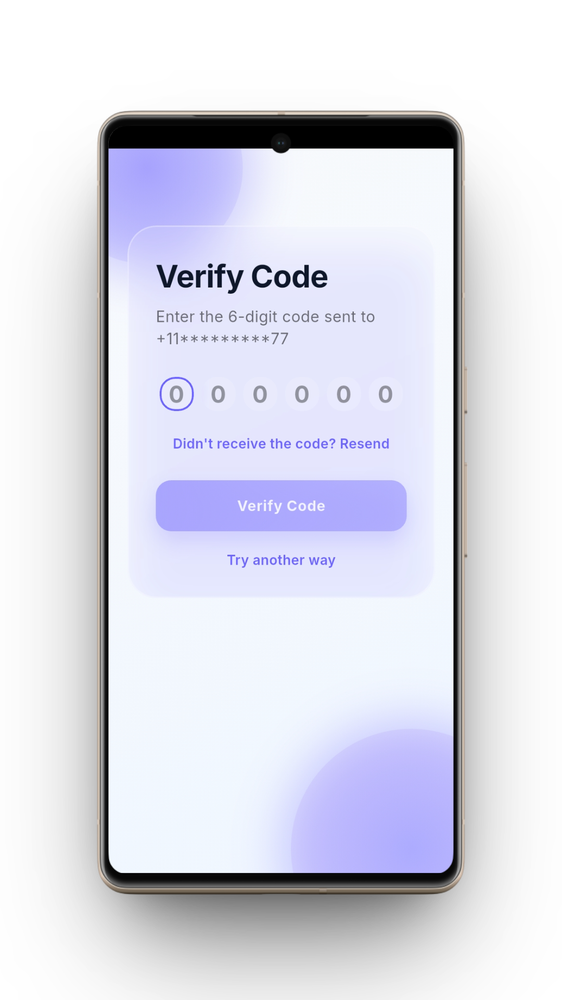
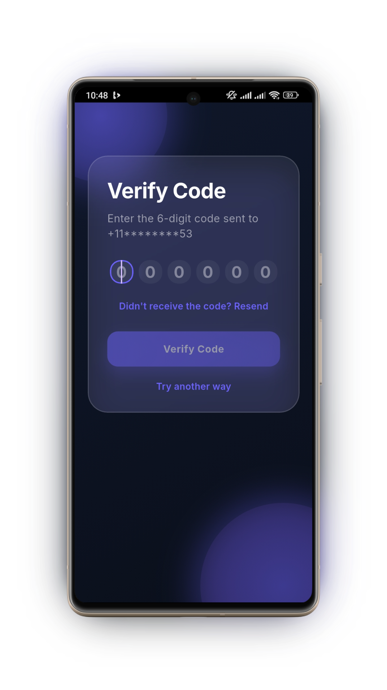
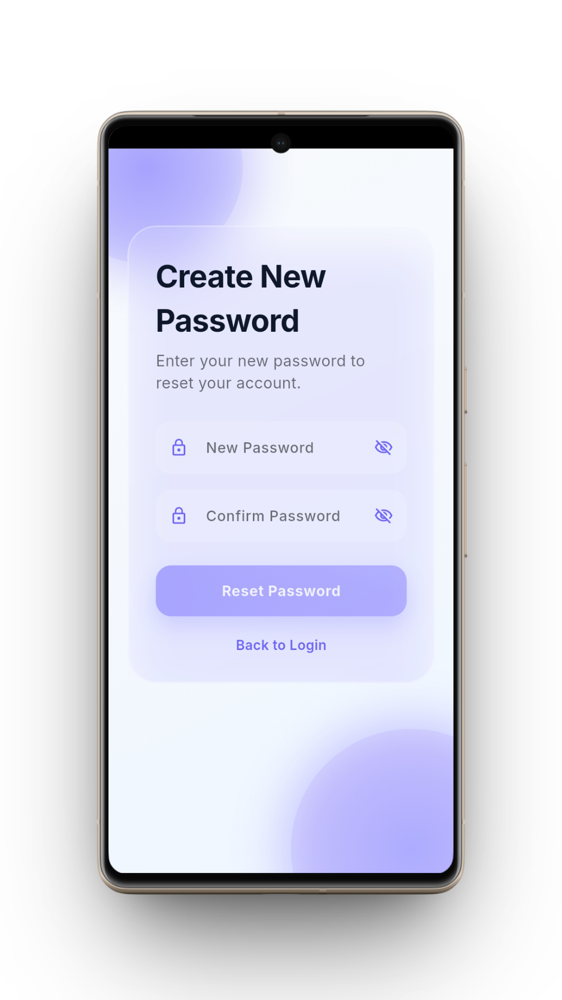

<!-- markdownlint-disable MD033 -->
# Flutter Authentication UI Template

A production-ready Flutter authentication system with modern glassmorphism design, featuring Login/Signup, Forgot Password flow, and OTP verification. Built with Material 3, responsive design, and zero backend dependencies.

<p align="center">
  
  
  
  
  
</p>

---

## 📱 Preview

| Screen | Light Mode | Dark Mode |
| :--- | :---: | :---: |
| **Login** |  |  |
| **Signup** |  |  |
| **Forgot Password** |  |  |
| **OTP Verification** |  |  |
| **New Password** |  |  |

---

## ✨ Features

### 🎨 **Modern UI/UX**

- ✅ **Glassmorphism design** with blur effects and transparency
- ✅ **Smooth animations** and page transitions
- ✅ **Rive animated character** - Interactive bunny/bear responds to user inputs
- ✅ **Gradient backgrounds** with floating orbs
- ✅ **Soft shadows** and rounded corners
- ✅ **Dark/Light mode** support (Material 3)
- ✅ **Fully responsive** (iOS & Android optimized)

### 🔐 **Authentication Screens**

- ✅ **Login/Signup Screen**
  - Seamless toggle between modes with validation
  - Animated character responds to focus changes
  - Eye tracking animation (follows email input)
  - Password eye cover animation (privacy feature)
  - Social login buttons (Google, Facebook, Apple)
  
- ✅ **Forgot Password Screen**
  - Email & Phone number support
  - Country code selector (25+ countries)
  - Live validation feedback
  
- ✅ **OTP Verification**
  - 6-digit OTP with autofocus
  - Auto-advance to next field
  - 60-second countdown timer
  - Resend OTP functionality
  - Masked contact display
  
- ✅ **Create New Password**
  - Password reset with real-time validation
  - Confirm password matching
  - Show/hide password toggle
  
- ✅ **Home Screen**
  - Example post-authentication screen

### 🛡️ **Security & Validation**

- ✅ **Real-time email validation** with visual feedback
- ✅ **Strong password requirements** (8+ chars, uppercase, number, special char)
- ✅ **Phone number validation** (9+ digits)
- ✅ **Name validation** (capital letter requirements)
- ✅ **Password matching** confirmation
- ✅ **Form validation** with TextFormField

---

## 🎬 Rive Animation Integration

<p align="center">
  <a href="https://rive.app/marketplace/19399-36451-logininteraction/">
    <b>View Interactive Animation Source on Rive Marketplace</b>
  </a>
</p>

The project uses **Rive** for the interactive character animation on the Login/Signup screen.

- **Asset Location**: `assets/animated-login-bunny-character.riv`
- **Controller**: Managed in `lib/Logic/auth_logic.dart` (`AuthLogic` class)
- **Interactions**:
  - **`isFocus`**: Triggered when Email or Password field gains focus
  - **`eye_track`**: Follows the cursor length in the Email field
  - **`IsPassword`**: Triggered when Password field is focused (character covers eyes)
  - **`login_success`**: Triggered on successful validation (character smiles)
  - **`login_fail`**: Triggered on validation error (character shakes head)

---

## 📁 Project Structure

```text
lib/
├── Screens/          # 5 Authentication screens
├── Widgets/          # Reusable UI components
├── Logic/            # Business logic & Rive controller
├── Models/           # Data models (Country codes)
└── Styles/           # Theme, colors, validations

assets/
├── animated-login-bunny-character.riv
├── fonts/Inter/
└── icons/           # Social login SVG icons

assets/
├── animated-login-bunny-character.riv # Rive animation file
├── fonts/                        # Inter font family
└── icons/                        # social login SVG icons
```
---

## 🔧 Technical Details

### Built With
- **Flutter 3.0+** - Cross-platform framework
- **Dart 3.0+** - Programming language
- **Material Design 3** - Latest design system
- **Rive** - Interactive animations
- **Flutter SVG** - Crisp social icons

### Architecture
- Clean separation of UI and business logic
- Centralized theme system
- Reusable component library
- Minimal dependencies
- Production-ready code

### Platform Support
- ✅ **Android 5.0+** (Fully tested)
- ✅ **iOS 12+** (Flutter-native, compatible)
- ⚠️ **Web** (Runs but needs responsive adjustments)

---

## 📖 Usage Guide

### 1. **Login/Signup Screen**

<p align="center">
  
  
</p>

Located in `lib/Screens/login_signup_screen.dart`

**Features:**

- Toggle between Login and Signup modes
- Email validation on focus change with checkmark indicator
- Password strength requirements with show/hide toggle
- Full name validation (only for signup mode)
- Form validation before submission
- **Rive animated character** that responds to interactions:
  - Eyes track email input length
  - Eyes close when typing password
  - Character smiles on successful login
  - Character shakes on validation error
- **Social Login Buttons:**
  - Google (Red) - UI ready for Firebase integration
  - Facebook (Blue) - UI ready for Facebook SDK
  - Apple (Black) - UI ready for Sign in with Apple

**Navigate to home screen:**

```dart
Navigator.push(
  context,
  MaterialPageRoute(builder: (context) => const HomeScreen()),
);
```

---

### 2. **Forget Password Flow**

<p align="center">
  
  
  
</p>

Located in `lib/Screens/forget_password_flow.dart`

The flow handles three screens automatically:

#### **Screen 1: Forgot Password**

- Choose between Email or Phone recovery
- **Email**: Standard email input with validation
- **Phone**: Country code selector (25+ countries) + phone number
- Real-time validation with visual feedback

#### **Screen 2: OTP Verification**

- 6 separate digit boxes with custom styling
- Autofocus on first box
- Auto-move to next field on input
- 60-second countdown timer (starts on resend)
- Masked contact display for privacy (e.g., `a***@example.com`)

#### **Screen 3: Create New Password**

- New password field with validation
- Confirm password field with matching check
- Show/hide password toggle for both fields
- Form validation before reset
- Navigate to Login Screen

**Navigate to Login password:**

```dart
// Password reset complete - Return to Login Screen
  void _handlePasswordReset() {
    // Show Success Message
    authLogic.showSuccessSnack('Password Reset Successfully', context);
    // Return to Login after delay
    Future.delayed(const Duration(milliseconds: 500), () {
      if (mounted) {
        widget.onBackToLogin();
      }
    });
  }
```

---

### 3. **Validation System**

All validations are centralized in `lib/Styles/validations.dart`

#### **Email Validation:**

```dart
String? validateEmail(String? email) {
  // Checks: not empty, valid email format
  // Returns: null if valid, error message if invalid
}
```

**Rules:**

- Must not be empty
- Must contain `@` and `.`
- Must follow standard email format

#### **Password Validation:**

```dart
String? validatePassword(String? password, {bool isSignup = false}) {
  // Checks: 8+ chars, uppercase, number, special char
  // Returns: null if valid, error message if invalid
}
```

**Rules:**

- Minimum 8 characters
- At least one uppercase letter
- At least one number
- At least one special character (`!@#$%^&*`)

#### **Name Validation:**

```dart
String? validateName(String? name) {
  // Checks: not empty, starts with capital letter
  // Returns: null if valid, error message if invalid
}
```

**Rules:**

- Must not be empty
- Must start with a capital letter

#### **Phone Validation:**

```dart
String? validatePhoneNumber(String? phone) {
  // Checks: 9+ digits, numbers only
  // Returns: null if valid, error message if invalid
}
```

**Rules:**

- Must be at least 9 digits
- Must contain only numbers

---

### 4. **Styling & Themes**

<p align="center">
  
</p>

All colors, spacing, and typography are centralized in `lib/Styles/styles.dart`

#### **Colors**

```dart
// Colors
AppTheme.primaryAccent           // Main purple color (#6C63FF)
AppTheme.lightBg                 // Background color (#F8FAFC)
AppTheme.darkBg                 // Background color (#0F172A)
AppTheme.errorRed                // Error state (#EF4444)
AppTheme.successGreen            // Success state (#10B981)

```

#### **Spacing**

```dart
AppTheme.spacingSmall = 8
AppTheme.spacingMedium = 16
AppTheme.spacingMediumLarge = 20
AppTheme.spacingLarge = 24
AppTheme.spacingXLarge = 28
AppTheme.spacingXXLarge = 40
```

---

#### **Border Radius**

```dart
AppTheme.borderRadiusSmall = 16
AppTheme.borderRadiusMedium = 30
AppTheme.borderRadiusLarge = 40
```

#### **Text Styles**

```dart
AppTheme.headingStyle(isDark)     // Large heading text
AppTheme.subheadingStyle(isDark)  // Sub heading text style
AppTheme.bodyStyle(isDark)        // Body paragraph text
AppTheme.buttonStyle              // Button text style
AppTheme.subtitleStyle(isDark)    // Subtitle text style
```

#### **Decoration Helpers**

```dart
AppTheme.backgroundGradient(isDark)  // Background Gradient
AppTheme.socialButtonDecoration(isDark)   // Social button style
AppTheme.inputDecoration(isDark)         // Input box style
```

---

### 5. **Authentication Logic**

Located in `lib/Logic/auth_logic.dart`

**Handles:**

- Rive animation initialization and state management
- Focus node listeners for input fields
- Snackbar messages (success/error)
- Field clearing on mode toggle
- Eye track animation updates based on email length

**Key Methods:**

```dart
class AuthLogic {
  // Rive Animation
  void initRive() // Initialize Rive controller and inputs
  void setupListeners() // Setup listeners for focus nodes
  void updateEyeTrack(String email) // Update eye tracking animation
  void triggerSuccess() // Trigger success animation
  void triggerFail() // Trigger failure animation
  
  // Validation & Feedback
  void showSuccessSnack(String message, BuildContext context) // Show success snackbar
  void showErrorSnack(String message, BuildContext context) // Show error snackbar
  
  // Cleanup
  void clearFields() // Clear all text controllers
  void dispose() // Dispose focus nodes
}
```

---

### 🔠 Typography & Fonts

<p align="center">
  <a href="https://rsms.me/inter/"><b>Inter Font Family</b></a>
</p>

The project uses the **Inter** font family for a clean, modern look.

---

## 📋 Screen Details

### Login/Signup (`login_signup_screen.dart`)

| Feature           | Details                                   |
|-------------------|-------------------------------------------|
| Email Validation  | Real-time with checkmark indicator        |
| Password Strength | 8+ chars, uppercase, number, special char |
| Name Validation   | Capital first letter required (signup)    |
| Animation         | Rive character responds to inputs         |
| Social Buttons    | Google, Facebook, Apple (UI ready)        |
| Form Validation   | All fields validated before submission    |

---

### Forgot Password (`forget_password_screen.dart`)

| Feature     | Details                              |
|-------------|--------------------------------------|
| Methods     | Email or Phone number recovery       |
| Email Input | Standard email field with validation |
| Phone Input | Country selector + number field      |
| Countries   | 25+ countries with flags & dial codes|
| Validation  | Live validation with visual feedback |
| Button      | Enabled only when input is valid     |
| Navigation  | Auto-advances to OTP screen          |

---

### OTP Verification (`otp_verification_screen.dart`)

| Feature         | Details                                    |
|-----------------|--------------------------------------------|
| OTP Format      | 6 separate digit boxes                     |
| Auto-Focus      | First box focused on screen load           |
| Auto-Move       | Moves to next box automatically on input   |
| Masking         | Email/Phone masked for privacy             |
| Timer           | 60-second countdown (starts on resend)     |
| Resend          | Available after timer reaches 0            |
| Contact Display | Shows masked email (a***@example.com)      |
| Validation      | Verifies all 6 digits are entered          |

---

### New Password (`new_password_screen.dart`)

| Feature        | Details                                   |
|----------------|-------------------------------------------|
| Validation     | Uses TextFormField validators             |
| Password Rules | 8+ chars, uppercase, number, special char |
| Confirmation   | Must match new password exactly           |
| Toggle         | Show/Hide password visibility             |
| Error Display  | Below field in red text                   |
| Button         | Enabled when all validations pass         |
| Success        | Shows success message on reset            |

---

## 📦 Dependencies

This template uses minimal dependencies for maximum flexibility:

```yaml
dependencies:
  flutter:
    sdk: flutter
  
  # Essential packages
  rive: ^0.13.1              # Interactive character animation
  flutter_svg: ^2.2.3        # Social icons rendering

# No heavy state management libraries
# No bloated UI frameworks
# Easy to integrate with your existing codebase
```

> **Note:** Package versions shown are current as of February 2026. Always check [pub.dev](https://pub.dev) for the latest versions.

---

## 🎓 Learning Resources

- [Flutter Documentation](https://flutter.dev/docs) - Official Flutter docs
- [Material Design 3](https://m3.material.io/) - Material 3 guidelines
- [Dart Language Guide](https://dart.dev/guides) - Dart programming
- [Rive Documentation](https://help.rive.app/) - Rive animation tutorials
- [Form Validation in Flutter](https://flutter.dev/docs/cookbook/forms/validation) - Form handling

---

## 🎉 What's Included

✅ **Complete authentication flow** (Login, Signup, Password Recovery)  
✅ **Modern glassmorphism UI** with blur effects  
✅ **Rive animated character** that responds to user input  
✅ **Email & phone support** for password recovery  
✅ **OTP verification** with countdown timer  
✅ **Dark/Light mode** with Material 3  
✅ **Fully responsive** design (iOS & Android)  
✅ **Production-ready code** with clean architecture  
✅ **Comprehensive validation** for all inputs  
✅ **Error handling** and user feedback  
✅ **Smooth animations** and transitions  
✅ **Social login buttons** 
✅ **Reusable components** for your app  
✅ **Zero backend required** (UI template only)  

---

## 📊 Version History

### **v1.0.0** (February 2026) - Initial Release

- ✅ Complete authentication flow
- ✅ Rive character animation
- ✅ Dark/Light mode support
- ✅ OTP verification with timer
- ✅ Social login UI
- ✅ Comprehensive documentation

---

## Credits

**Built with:**

- Flutter & Dart
- Rive for animations
- Material Design 3
- Inter font family
- Flutter SVG for icons

---

<p align="center">
  <b>Made with ❤️ for beautiful, modern authentication experiences.</b>
</p>

<p align="center">
  <i>Last Updated: February 2026 | Version: 1.0.0</i>
</p>

<p align="center">
  <a href="#-premium-authentication-ui-template">Back to Top ↑</a>
</p>

---
